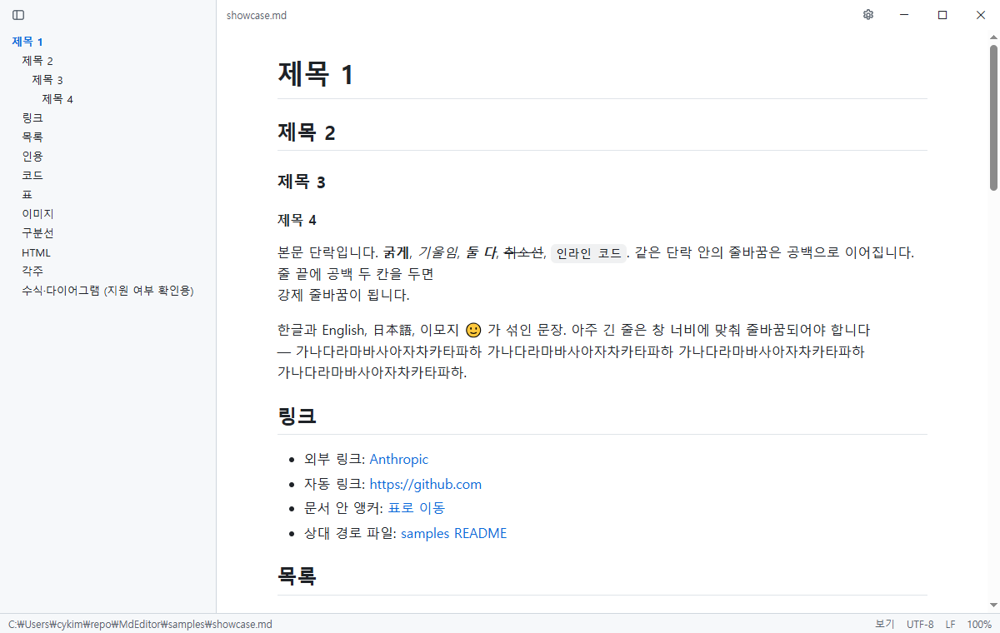
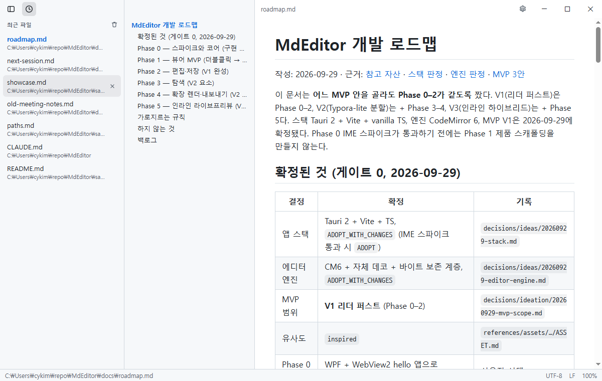
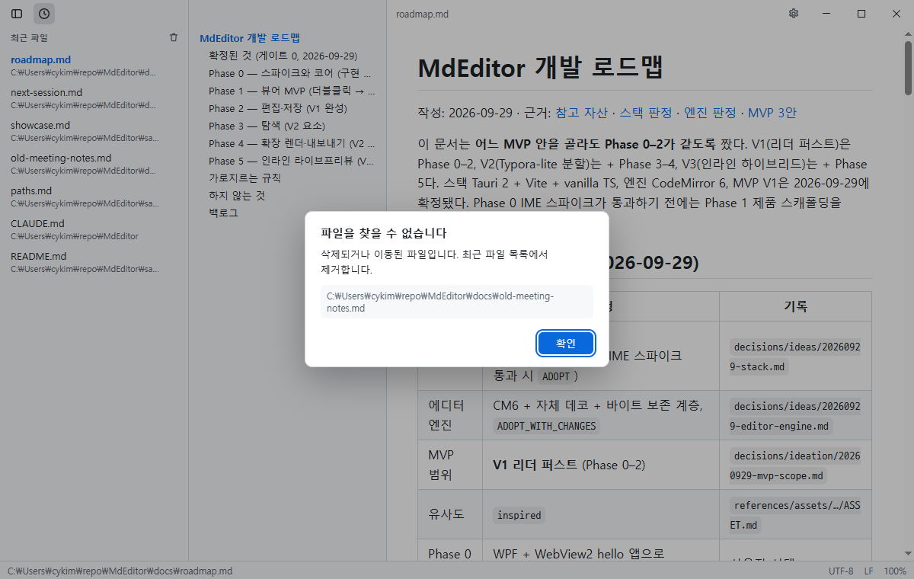
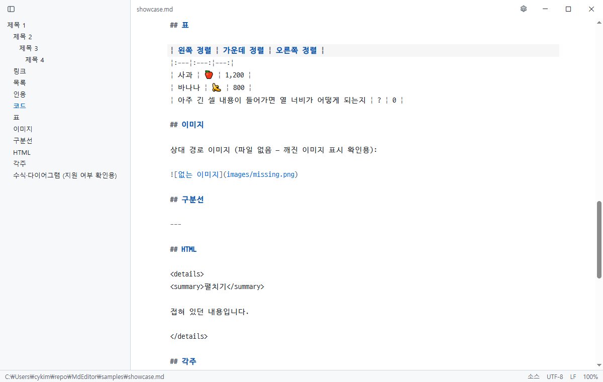
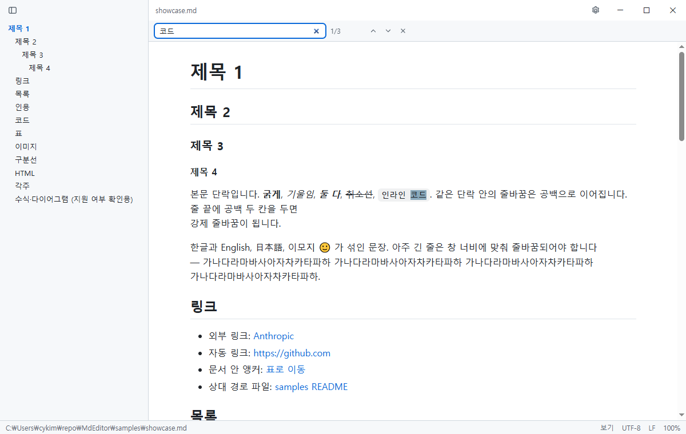
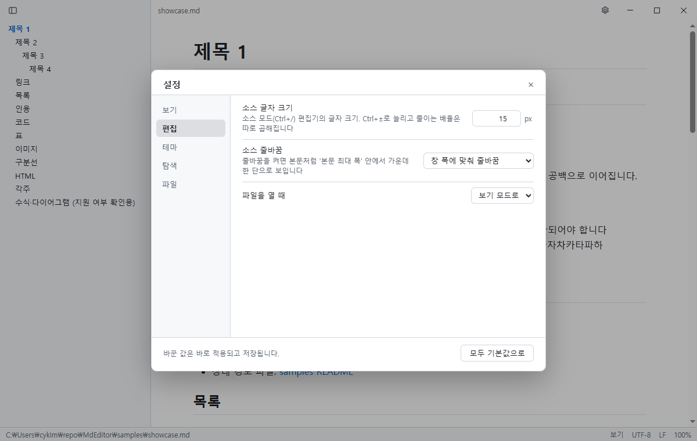
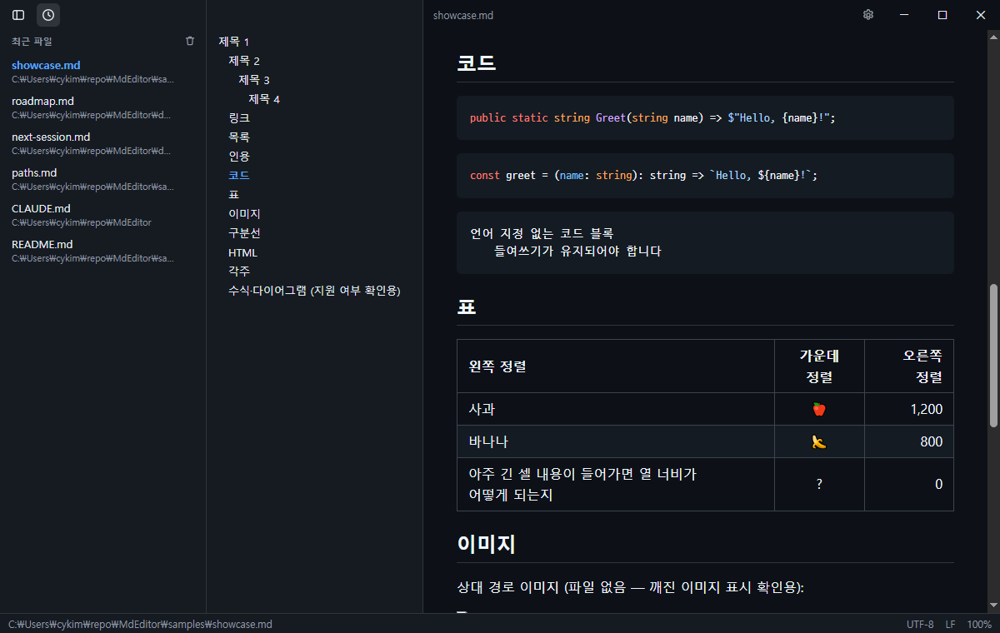

# Frond

Markdown(`.md`) 파일을 보고 편집하는 개인용 Windows 데스크톱 앱입니다. Tauri 2 기반이라 설치기가 작고(약 5 MB) 빨리 뜹니다.
이름 Frond는 고사리 잎이라는 뜻입니다(2026-10-06까지는 MdEditor).



> **현재 단계: V2 진행 중.** MVP V1(보기·편집·저장, 설정·테마)에 더해 탭·분할 뷰·폴더 트리·외부 변경 비교·세션 복원·AI 훅 받은 목록(Phase 3)과
> Mermaid·GitHub Alerts·KaTeX 수식·HTML 내보내기·인쇄 손질(Phase 4)이 구현돼 있습니다. 실기 확인 목록은 [docs/next-session.md](docs/next-session.md) §2, 전체 계획은 [docs/plan.md](docs/plan.md)·[docs/roadmap.md](docs/roadmap.md)에 있습니다.

## 주요 기능

- `.md` 더블클릭 → 바로 렌더. 이미 떠 있으면 새 창을 띄우지 않고 같은 창의 **새 탭**으로 엽니다
- **탭** — 문서마다 편집 상태(되돌리기 기록·커서)·스크롤·모드가 따로 남고, 다음 실행 때 지난 탭을 다시 엽니다
- **분할 뷰**(`Ctrl+Shift+/`) — 왼쪽 소스, 오른쪽 미리보기. 스크롤이 서로 따라가고 고친 블록만 바로 다시 그립니다
- **폴더 트리** — 탐색 영역 '폴더' 탭. 목차와 함께 보이고, 폴더에 파일이 생기거나 사라지면 바로 갱신됩니다
- GitHub 스타일 렌더: 표·체크리스트·각주·front matter·코드 구문 강조, **Mermaid 다이어그램**, **GitHub Alerts**(`> [!NOTE]` 등), **수식**(`$…$`·`$$`, KaTeX)
- **HTML 내보내기** — 보이는 그대로(테마 색·코드·그림·수식) 한 파일로, 이미지는 파일 안에 넣거나 경로로. **인쇄·PDF**는 쪽 번호와 함께
- **소스 모드 편집(`Ctrl+/`)과 저장(`Ctrl+S`)** — 고친 줄만 다시 쓰고 나머지 바이트(인코딩·BOM·줄바꿈·끝 개행)는 그대로 둡니다
- 다른 편집기와 부딪히지 않게: 연 뒤에 파일이 바뀌었으면 덮어쓰기 전에 묻고, 편집 중 외부 변경은 배너로 알립니다. **비교**로 디스크 내용과 편집 중 내용의 차이를 보고 부분마다 고릅니다
- **AI 훅 문서 받은 목록** — Claude Code·Codex가 새 md를 만들면 보던 문서를 바꾸지 않고 '새 문서' 목록에 쌓습니다([integrations/](integrations/README.md))
- 초안 백업 — 저장하지 않은 편집을 주기적으로 남겨 강제 종료 뒤에 복구합니다
- 찾기(보기·소스 모드)와 바꾸기(소스 모드), 이미지 붙여넣기·끌어다 놓기 → 문서 옆 `assets/`에 저장
- 테마: 라이트·다크 내장(미니멀 화이트 세이지 차콜 — 흰 바탕·차콜 글자에 세이지 초록빛), **사용자 테마 가져오기**(색 토큰 JSON), 전환할 때 색이 서서히 바뀝니다
- 한국어 타이포그래피: 단어 중간에서 줄이 끊기지 않고, 코드는 D2Coding 글꼴
- 경계 없는 제목 표시줄, 열고 닫는 탐색 영역(최근 파일 — 문서 제목 표시), 폭을 바꾸는 목차
- 다른 편집기에서 저장하면 자동으로 다시 읽기(스크롤 위치 유지)
- UTF-8·CP949(EUC-KR) 자동 판별, 다른 인코딩으로 다시 열기·UTF-8로 변환
- 10 MB 문서도 열립니다 — 2 MB가 넘으면 큰 문서 모드(블록 묶음 단위로 화면 밖 레이아웃 생략)로 그려, 스크롤·줌·패널 열고 닫기가 0.1초 안팎입니다

## 설치

준비물: [Node.js](https://nodejs.org/) 20 이상, [Rust](https://rustup.rs/)(stable, MSVC), Windows 10/11.

```powershell
npm install
npm run app:build
```

`target\release\bundle\nsis\Frond_0.1.0_x64-setup.exe`가 만들어집니다. 실행하면 현재 사용자 계정에 설치됩니다(관리자 권한 불필요, `%LOCALAPPDATA%\Frond`). WebView2 런타임이 없으면 설치기가 내려받습니다.

**같은 버전을 다시 설치할 때**는 설치기가 "이미 설치됨" 페이지를 먼저 띄웁니다. **추가/재설치**를 골라 끝까지 진행해야 파일이 바뀝니다(창을 닫으면 아무것도 바뀌지 않음). 페이지 없이 덮어쓰려면 `Frond_0.1.0_x64-setup.exe /S`.

**MdEditor 이름으로 설치한 적이 있으면** 먼저 제거(설정 → 앱 → MdEditor, '앱 데이터 삭제'는 체크하지 않음 — Frond와 같은 폴더라 설정이 지워짐)한 뒤 설치합니다. 이름이 바뀌어 설치 폴더가 달라졌기 때문에, 그냥 설치하면 두 앱이 나란히 남습니다. 설정·최근 파일·`.md` 기본 앱 지정은 그대로 이어지고, 테마·초안 폴더(`%APPDATA%\MdEditor`)는 처음 실행할 때 `%APPDATA%\Frond`로 옮겨집니다.

### `.md` 기본 앱으로 지정

- 탐색기에서 `.md` 파일 우클릭 → **연결 프로그램** → **다른 앱 선택** → **Frond**를 고르고 **항상 이 앱을 사용하여 .md 파일 열기**를 체크
- 또는 앱 상태바의 **기본 앱으로 설정** 버튼(현재 기본 앱이 아닐 때만 보임) → Windows 기본 앱 설정에서 Frond 선택

## 사용법

### 파일 열기

| 방법 | 설명 |
|---|---|
| 탐색기에서 더블클릭 | 기본 앱으로 지정했거나 **연결 프로그램**으로 열 때 |
| 창에 끌어다 놓기 | 파일을 창 아무 곳에나 놓으면 됩니다 (여러 개면 탭 여러 개, 소스·분할 모드에서 이미지 파일을 놓으면 이미지 삽입) |
| `Ctrl+O` | 파일 열기 대화상자 (`.md`·`.markdown`·`.txt` 등, 여러 개 고르기 가능) |
| 최근 파일·폴더·새 문서 | 왼쪽 탐색 영역의 목록에서 클릭 |
| 문서 안 링크 | 다른 `.md`로 가는 로컬 링크는 앱 안에서 열립니다. `http(s)`·`mailto` 링크는 기본 브라우저로 열립니다 |

여는 문서는 **새 탭**이 됩니다. 이미 열려 있으면 그 탭으로 갑니다.

### 탭

- 제목 표시줄 가운데에 열린 문서가 탭으로 보입니다. 누르면 그 문서로, **×**·가운데 버튼·`Ctrl+W`로 닫습니다. 저장하지 않은 탭은 × 자리에 점(●)
- 끌어서 순서를 바꿉니다. 오른쪽 클릭: 닫기·다른 탭 모두 닫기·오른쪽 탭 모두 닫기·경로 복사·파일 위치 열기
- `Ctrl+Tab` / `Ctrl+Shift+Tab`(또는 `Ctrl+PageDown`/`PageUp`) 다음·이전 탭, `Ctrl+1`~`8` 그 번째 탭, `Ctrl+9` 마지막 탭, `Ctrl+Shift+T` 닫은 탭 다시 열기
- 탭마다 보기·소스·분할 모드, 스크롤 위치, 편집기의 되돌리기 기록·커서·선택이 따로 남습니다
- 창을 닫을 때 저장하지 않은 탭이 여럿이면 한 번에 **모두 저장 / 모두 저장 안 함 / 취소**를 묻습니다
- **세션 복원**: 다음에 실행하면 지난번 탭(보기·소스·분할, 보던 위치)을 다시 엽니다. 탭은 앞으로 올 때 그리므로 많아도 시작이 느려지지 않습니다. 설정 탐색 탭 **시작할 때**로 끕니다
- 2 MB가 넘는 큰 문서는 최근에 본 2개만 화면을 그려 두고, 나머지는 앞으로 올 때 다시 그립니다(메모리)

### 화면 구성



| 영역 | 설명 |
|---|---|
| **제목 표시줄** (맨 위) | 가운데에 문서 탭. 빈 곳을 끌면 창 이동(화면 끝에 붙이기 가능), 두 번 클릭하면 최대화/복원. 창 가장자리를 끌어 크기를 바꿉니다. 왼쪽 끝은 탐색 영역 토글, 오른쪽은 설정·최소화·최대화·닫기 |
| **탐색 영역** (왼쪽) | 위쪽 정사각형 탭으로 패널을 고릅니다 — **최근 파일**, **폴더**(폴더 트리), **AI가 만든 새 문서**(안 읽은 수 배지) |
| **목차** | 문서의 제목 목록. 클릭하면 그 제목으로 이동하고(소스 모드에서는 그 줄로), 스크롤하면 지금 읽는 제목이 파랗게 표시됩니다 |
| **본문** | 렌더된 문서(보기 모드), Markdown 원문 편집기(소스 모드), 또는 둘을 나란히(분할). 폭은 설정의 **본문 최대 폭**을 따릅니다 |
| **상태바** (맨 아래) | 파일 경로 · **새 문서 n**(AI 훅이 만든 안 읽은 문서, 누르면 목록) · 단어 수(눌러서 단어 ↔ 글자 ↔ 공백 제외 글자) · **보기/소스/분할**(눌러서 모드 메뉴) · 인코딩(눌러서 다시 열기·변환, 해석 못 한 바이트가 있으면 빨간색) · 줄바꿈(눌러서 LF·CRLF로 변환, 섞여 있으면 "(혼합)") · 줌 비율. 관리자 권한으로 실행하면 빨간 **관리자 권한 실행 중** |

### 탐색 영역 — 최근 파일·폴더·새 문서

- 제목 표시줄 왼쪽 끝 버튼이나 `Ctrl+Shift+E`로 열고 닫습니다. 열림 상태는 다음 실행 때도 유지됩니다

**폴더** 탭 (폴더 트리)

- 지금 문서의 폴더를 보여 주고, 폴더 버튼(**폴더 열기…**)으로 다른 폴더를 고정할 수 있습니다. 고정을 풀려면 과녁 버튼(**지금 문서의 폴더 따라가기**)
- 하위 폴더와 마크다운 문서(`.md`·`.markdown` 등)만 보입니다. 점으로 시작하는 폴더(`.git` 등)·숨김 파일·`node_modules`는 빼고 보여 줍니다
- 폴더를 누르면 펼치고 접습니다(펼친 상태는 기억). 문서를 누르면 탭으로 열고, 지금 문서는 파랗게 표시됩니다
- 다른 프로그램이 파일을 만들거나 지우면 그 폴더만 바로 다시 읽습니다
- 오른쪽 클릭: 열기·이 폴더를 트리 맨 위로·파일 위치(탐색기)·경로 복사

**AI가 만든 새 문서** 탭

- Claude Code·Codex 훅([integrations/](integrations/README.md))이 새 md를 만들면, 보던 문서를 그대로 두고 창도 앞으로 가져오지 않은 채 이 목록에 쌓습니다(작업 표시줄만 깜빡). 안 읽은 문서는 점·탭 배지·상태바 **새 문서 n**으로 보입니다
- 누르면 탭으로 열고 읽음으로 바뀝니다. 오른쪽 클릭: 파일 위치 열기·목록에서 빼기. 휴지통 버튼으로 모두 지우기
- 설정 탐색 탭 **AI 훅이 만든 문서**: 목록에 쌓기(기본) / 뒤 탭으로 열기 / 바로 열기(예전처럼 앞으로). 열린 문서가 없으면 바로 엽니다

**최근 파일** 탭
- 문서를 열 때마다 목록 맨 위에 올라가고, 지금 연 파일은 파란색으로 표시됩니다
- 항목은 두 줄입니다 — 문서 제목(front matter의 `title:`, 없으면 첫 `#` 제목)이 있으면 **제목 / 파일 이름·폴더**, 없으면 **파일 이름 / 폴더**
- 항목에 마우스를 올리면 나오는 **×** 로 하나씩, 휴지통 버튼으로 전체를 지웁니다(한 번 더 확인). 목록에서만 빠지고 파일은 지워지지 않습니다
- 지워지거나 옮겨진 파일을 누르면 알림을 띄우고 목록에서 뺍니다



### 편집과 저장



- `Ctrl+/`로 **보기 ↔ 소스** 모드를 오갑니다. 보던 위치가 그대로 이어지고, 소스 모드로 들어가면 커서가 보던 줄에 놓입니다. 설정 **파일을 열 때**로 처음 모드를 고릅니다
- `Ctrl+Shift+/`(또는 상태바 모드 메뉴)로 **분할 뷰** — 왼쪽 소스, 오른쪽 미리보기. 어느 쪽을 스크롤해도 다른 쪽이 같은 자리로 따라옵니다(긴 표·코드 안에서도 비율대로). 편집하면 0.1초쯤 뒤에 바뀐 블록만 다시 그려 이미지가 깜빡이지 않습니다(2,000줄 문서 갱신 0.1초 안). 가운데 경계를 끌어 폭을 바꾸고(두 번 누르면 반반), 2 MB가 넘는 문서는 저장할 때 미리보기를 갱신합니다
- `Ctrl+S` 저장, `Ctrl+Shift+S` 다른 이름으로 저장(원래 파일의 인코딩·줄바꿈을 그대로 가져갑니다). 한글 조합 중에 눌러도 조합을 확정한 뒤 저장합니다
- **바이트 보존**: 고친 줄만 다시 쓰고, 나머지 줄의 줄바꿈(LF/CRLF/혼합)·인코딩·BOM·끝 개행은 원본 그대로입니다. 고친 것이 없으면 원본 바이트를 그대로 씁니다
- **저장 충돌**: 연 뒤에 다른 프로그램이 파일을 저장했으면 덮어쓰기 전에 **다른 이름으로 저장 / 덮어쓰기 / 취소**를 묻습니다. 파일이 지워졌으면 **다시 만들기**
- **편집 중 외부 변경**: 저장하지 않은 편집이 있을 때 파일이 바뀌면 배너로 **비교 / 다시 읽기(내 변경 버림) / 내 변경 유지**를 고릅니다. 편집이 없으면 예전처럼 조용히 다시 읽습니다(뒤 탭도)
- **비교**: 편집기 안에 디스크 내용(빨강)과 편집 중 내용(초록)의 차이가 보입니다. 부분마다 **내 것 유지 / 디스크 것으로**를 고르고, 다 고르면 저절로 끝납니다. 비교한 뒤 저장하면 충돌을 다시 묻지 않고 편집기 내용으로 씁니다. 저장 충돌 팝업에서도 **비교**를 고를 수 있습니다
- **표현할 수 없는 문자**: EUC-KR 파일에 이모지처럼 그 인코딩에 없는 문자를 넣고 저장하면 몇 행 몇 열인지 알려 주고 **UTF-8로 변환해 저장**을 제안합니다
- **손실 디코드 문서**(해석 못 한 바이트가 있는 파일)는 원본이 망가지지 않게 읽기 전용입니다. 상태바 인코딩을 눌러 맞는 인코딩으로 다시 여세요
- **닫기**: 저장하지 않은 변경이 있으면 창을 닫기 전에 묻습니다(제목 표시줄 닫기·`Alt+F4` 모두)
- **초안 백업**: 저장하지 않은 편집을 설정한 간격(기본 60초)마다 `%APPDATA%\Frond\drafts`에 남깁니다. 강제 종료·정전 뒤 같은 파일을 열면 **복구 / 초안 버리기**를 묻습니다. 저장하거나 변경을 버리면 지워집니다
- **이미지 붙여넣기**: 소스 모드에서 캡처한 이미지를 `Ctrl+V`하면 문서 폴더의 `assets/image-날짜-시각.png`로 저장하고 링크를 넣습니다. 이미지 파일을 끌어다 놓으면 `assets/`로 복사합니다(이미 문서 폴더 안에 있는 파일은 복사하지 않고 그 경로로 링크)

### 인코딩

상태바의 인코딩을 누르면 메뉴가 열립니다.

- **다시 열기**(UTF-8 / EUC-KR / UTF-16LE): 파일은 그대로 두고 글자 해석만 바꿉니다. 글자가 깨져 보일 때 씁니다
- **변환해 저장**(UTF-8 / UTF-8 BOM): 파일을 새 인코딩으로 바로 저장합니다. 파일 바이트가 바뀝니다

### 줄바꿈

상태바의 줄바꿈(`LF` / `CRLF`, 섞여 있으면 `(혼합)`)을 누르면 **LF로 변환해 저장 / CRLF로 변환해 저장**을 고릅니다. 모든 줄의 줄바꿈을 하나로 맞춰 바로 저장합니다. 평소 저장은 지금처럼 줄마다 원래 줄바꿈을 지키고, 변환은 고른 그 저장 한 번만 합니다.

### 찾기와 바꾸기



- 보기 모드 `Ctrl+F`: 위쪽 찾기 막대. `Enter` 다음, `Shift+Enter` 이전, `Esc` 닫기. 대소문자는 가리지 않고, `**굵게**`처럼 서식 경계에 걸친 글자도 찾습니다
- 소스·분할 모드 `Ctrl+F` / `Ctrl+H`: 편집기 찾기·바꾸기 패널(대소문자 구분·단어 단위·정규식·모두 바꾸기). 보기 모드에서 `Ctrl+H`를 누르면 소스 모드로 넘어가 패널을 엽니다

### 목차

- 제목을 누르면 그 제목으로 이동합니다. 제목 위에 남는 간격은 설정의 **제목 이동 시 위쪽 여백**으로 바꿉니다
- 목차 오른쪽 경계를 끌어 폭을 바꿉니다(최소 160 px, 최대는 남은 폭의 절반). 경계를 두 번 누르면 기본 폭(260 px), 경계에 포커스를 두고 `←`/`→`로도 조절됩니다
- 아주 좁게(80 px 아래로) 끌면 목차가 접힙니다. `Ctrl+\`로 다시 엽니다
- 제목이 없는 문서, 창 폭이 720 px 이하일 때는 목차가 숨겨집니다
- 소스 모드에서 편집하면 작은 문서는 목차가 편집을 따라 바로 갱신됩니다

### 설정

`Ctrl+,` 또는 제목 표시줄의 톱니 버튼으로 엽니다. 왼쪽 탭(보기·편집·테마·탐색·파일)을 고르면 그 분류의 항목만 보입니다. 바꾼 값은 바로 적용되고 저장됩니다. 기본값과 다른 항목 옆의 ↺ 버튼으로 하나씩, **모두 기본값으로**로 한꺼번에 되돌립니다.



| 탭 | 항목 | 기본값 | 범위 | 설명 |
|---|---|---|---|---|
| 보기 | 본문 최대 폭 | 860 px | 480–1920 px | 창이 넓어도 본문 줄 길이를 이 폭으로 제한 (소스 모드 줄바꿈 폭도 같음) |
| 보기 | 상태바 글자 수 | 단어 수 | 단어 / 글자 / 글자(공백 제외) / 표시 안 함 | 보기 화면에 그린 본문 기준. 한글·영문은 띄어쓰기 단위, 한자·가나는 한 글자를 한 단어로. 상태바에서 눌러도 바뀝니다 |
| 편집 | 소스 글자 크기 | 15 px | 11–28 px | 소스 모드 편집기 글자 크기. 줌(`Ctrl+±`)은 따로 곱해집니다 |
| 편집 | 소스 줄바꿈 | 창 폭에 맞춰 줄바꿈 | 줄바꿈 / 없음 | 줄바꿈이면 본문처럼 가운데 한 단 |
| 편집 | 파일을 열 때 | 보기 모드로 | 보기 / 소스 | 문서를 처음 열 때의 모드 |
| 테마 | 테마 | 시스템 설정 따르기 | 시스템 / 내장·추천·구매자 전용·사용자 테마 | `Ctrl+Shift+D`로 바꿔도 여기에 저장됩니다 |
| 테마 | 라이트 테마 · 다크 테마 | 라이트 · 다크 | 해당 쪽 테마 | '시스템 설정 따르기'일 때 Windows 모드에 따라 쓸 테마 쌍. `Ctrl+Shift+D`는 이 둘 사이를 오갑니다 |
| 테마 | 테마 전환 시간 | 250 ms | 0–1000 ms | 색이 서서히 바뀌는 시간. 0이면 즉시, Windows 애니메이션 효과를 끄면 항상 즉시 |
| 탐색 | 제목 이동 시 위쪽 여백 | 24 px | 0–240 px | 목차·문서 안 링크로 제목에 이동할 때 제목 위에 남길 간격 |
| 탐색 | AI 훅이 만든 문서 | '새 문서' 목록에 쌓기 | 목록 / 뒤 탭 / 바로 열기 | Claude Code·Codex 훅이 새 md를 만들었을 때. 탐색기에서 연 파일은 늘 바로 엽니다 |
| 탐색 | 시작할 때 | 지난번 탭 다시 열기 | 다시 열기 / 빈 창 | 지난번 탭(모드·보던 위치)을 다시 엽니다 |
| 탐색 | 최근 파일 개수 | 20개 | 1–100개 | 탐색 영역에 보일 최근 파일 수 |
| 파일 | 초안 백업 간격 | 60초 | 0–300초 | 저장하지 않은 편집을 남기는 간격. 0이면 끔 |
| 정보 | (패널) | — | — | 버전·설치 방식·구매 상태. Microsoft Store판의 구매·구매 복원 자리(Store 출시 뒤에 열림) |

### 테마

기본은 Windows 설정(라이트/다크)을 따릅니다. `Ctrl+Shift+D`나 설정 **테마** 탭으로 바꿉니다.
내장 라이트·다크는 **미니멀 화이트 세이지 차콜** 팔레트입니다(2026-10-06부터, 그전 GitHub 색은 추천 테마의 **GitHub 라이트·다크**).



설정 **테마** 탭 아래의 **테마 목록**에서 테마를 고르고 관리합니다.


- **추천 테마…**: 앱에 들어 있는 테마 23종(세피아, GitHub 라이트·다크, media.io [웨딩 컬러 팔레트](https://www.media.io/ko/color-palette/wedding-color-palette.html) 20종)을 팝업에서 둘러보고 **적용**합니다. 폴더에 복사하지 않아도 테마 선택지에 있고, 쓰고 있는 추천 테마는 목록에도 보입니다. 팔레트 테마는 원본 5색에서 배경·글자·강조를 정하고, 연한 강조색은 읽을 수 있도록 밝기를 낮춰 씁니다
- **가져오기…**: 테마 파일(`.json`)을 골라 테마 폴더(`문서\Frond\themes`, 예전 `%APPDATA%\Frond\themes`에서 처음 실행 때 옮김)에 복사합니다. 파일이 잘못됐으면 어느 키·값이 틀렸는지 보여 주고 아무것도 저장하지 않습니다
- **적용 / 복제 / 내보내기 / 삭제**: 복제는 모든 색이 채워진 사본 파일을 만듭니다 — 새 테마를 만들 때 출발점으로 쓰세요. 내장 테마는 지울 수 없고, 쓰던 테마를 지우면 같은 쪽(라이트/다크) 내장 테마로 돌아갑니다
- **폴더 열기 / 다시 읽기**: 폴더에 직접 넣거나 고친 파일은 **다시 읽기**로 목록에 반영합니다
- 예제: [docs/themes/sepia.json](docs/themes/sepia.json) (세피아)
- 구매자 전용 테마 4종(고사리 새벽·이끼 밤·한지·먹): [docs/themes/supporter/](docs/themes/supporter/) — Microsoft Store판에서는 구매자만 적용하고(사용자 테마 만들기도 같다), 설치기판은 모두 열려 있습니다. 상태는 설정 **정보** 탭

#### 테마 파일

색 값만 담는 JSON입니다. 빠진 색은 `base` 쪽 기본 색(GitHub 라이트·다크)으로 채워지므로 바꾸고 싶은 색만 적으면 됩니다.

```json
{
  "id": "sepia",
  "name": "세피아",
  "base": "light",
  "shell": { "bg": "#f4ecd8", "fg": "#3b3228", "accent": "#9a5b13" },
  "doc": { "bgColor-default": "#f4ecd8", "fgColor-default": "#3b3228" }
}
```

| 키 | 설명 |
|---|---|
| `id` | 파일 이름이 되는 값. 영문·숫자로 시작하고 영문·숫자·`-`·`_`만(64자까지). `light`·`dark`는 쓸 수 없습니다. 없으면 파일 이름 |
| `name` | 목록에 보이는 이름 (1–60자) |
| `base` | `"light"` 또는 `"dark"` — 빠진 색을 채울 기본 색(GitHub 라이트·다크), 스크롤바 색 |
| `shell` | 앱 틀의 색: `fg` `bg` `muted` `line` `accent` `on-accent` `danger` `sidebar-bg` |
| `doc` | 본문·편집기 색: GitHub Markdown 팔레트 변수 이름(`fgColor-default`, `bgColor-default`, `bgColor-muted`, `borderColor-default`, `fgColor-accent`, `color-prettylights-syntax-keyword` 등 48개)과 `selection-bg`·`selection-bg-inactive`. 전체 목록은 **복제**한 파일에서 보입니다 |

값은 CSS 색(`#rrggbb`, `rgb()`, `hsl()`, 색 이름 등)만 받습니다. `url()`·`@import`처럼 색이 아닌 값은 거부합니다. 모르는 키는 경고만 하고 무시합니다.

### 그 밖에

- **외부 변경 자동 반영**: 연 파일을 다른 편집기에서 저장하면 몇 초 안에 다시 읽고 스크롤 위치를 유지합니다. 파일이 지워지거나 옮겨지면 본문 위에 배너가 뜨고 마지막 내용을 계속 보여 줍니다
- **다시 읽기**: `F5` (편집 중이면 변경을 버릴지 묻습니다)
- **줌**: `Ctrl+=` / `Ctrl+-` / `Ctrl+0` (50–300 %). 본문·편집기만 커지고 목차·메뉴는 그대로입니다
- **인쇄**: `Ctrl+P` 또는 오른쪽 클릭 메뉴의 **인쇄**. 제목 표시줄·목차·상태바를 빼고 본문만 인쇄하며, 긴 코드 줄은 접힙니다. 테마와 관계없이 라이트로 인쇄합니다. PDF 저장은 인쇄 대화상자에서 고릅니다. 1 MB 이상인 문서는 인쇄 미리보기가 오래 멈출 수 있어 먼저 **계속 / 취소**를 묻습니다

### Mermaid·GitHub Alerts·수식

- ` ```mermaid ` 코드 블록은 다이어그램으로 그립니다(순서도·시퀀스·파이·간트·클래스·상태 등, 마인드맵·아키텍처 다이어그램 제외). 라이브러리는 문서에 Mermaid가 있을 때만 불러오고, 라벨의 HTML·클릭 동작은 막습니다(`securityLevel: strict`). 라이트·다크 테마를 따라 다시 그리고, 문법이 틀리면 코드 블록 아래에 이유를 보입니다
- 인용의 첫 줄이 `[!NOTE]`·`[!TIP]`·`[!IMPORTANT]`·`[!WARNING]`·`[!CAUTION]`이면 GitHub처럼 색 틀·아이콘이 붙은 알림 상자로 그립니다. 그 줄에 다른 글자가 있거나 목록 안이면 보통 인용입니다
- **수식**: `$E=mc^2$`처럼 `$`로 감싸면 인라인, `$$` 줄 사이나 ` ```math ` 블록은 가운데 정렬 수식(KaTeX). GitHub처럼 `$5와 $10`, `$ x$`(안쪽 공백)는 글자 그대로이고 `\$`는 달러 기호입니다. 수식이 있을 때만 KaTeX를 불러오고, 틀린 수식은 빨간 원문으로 남깁니다
- 예제: [samples/extended.md](samples/extended.md)

### 내보내기·인쇄

제목 표시줄 설정 옆 **⋯(문서 메뉴)**: 파일 열기 · 폴더 열기 · **HTML로 내보내기…** · **인쇄 · PDF로 저장…** · 설정.

- **HTML로 내보내기**: 지금 화면 그대로(테마 색·본문 폭·코드 강조·Mermaid 그림·수식) HTML 파일 하나로 저장합니다. 이미지는 **파일 안에 넣기**(한 파일로 주고받기 좋음) 또는 **경로로 두기**(가볍지만 이미지 파일이 함께 있어야 함). 탭 오른쪽 클릭으로도 됩니다
- **인쇄·PDF**: `Ctrl+P` — PDF는 인쇄 대화상자에서 'Microsoft Print to PDF'·'PDF로 저장'. 소스·분할 모드에서도 고친 내용으로 본문을 찍고, 아래에 쪽 번호가 붙고, 다크 테마여도 라이트로 찍습니다(그림 포함). PDF 파일 이름은 문서 이름

### 알아 둘 점

- 문서 안의 HTML 태그는 허용 목록(`<details>`·`<summary>`·``·`<br>`·`<kbd>`·`<sub>`·`<sup>`·`<mark>`·표 태그 등)만 렌더하고, 속성도 `width`·`align`·`href`·`src` 같은 목록만 남깁니다. 목록 밖 태그(`<script>`, 산문 속 `List<String>` 등)는 글자 그대로 보이고, 주석 `<!-- -->`은 숨깁니다
- `https://`처럼 스킴이 있는 주소와 `www.`로 시작하는 주소가 자동 링크가 됩니다. `paths.md`·`example.com`처럼 둘 다 없는 것은 글자 그대로입니다
- 2 MB가 넘는 문서는 **큰 문서 모드**입니다 — 코드 구문 강조와 패널 열고 닫기 애니메이션을 생략하고, 화면 밖 블록은 100개 묶음 단위로 건너뛰었다가 스크롤해 올 때 그립니다. 테마 전환은 화면 전체 크로스페이드로 바뀝니다
- 관리자 권한으로 실행한 창에는 탐색기 더블클릭이 전달되지 않습니다(Windows UIPI). 상태바에 경고가 뜨면 앱을 일반 권한으로 다시 실행하거나 `Ctrl+O`·끌어다 놓기로 여세요

## 단축키

| 단축키 | 동작 |
|---|---|
| `Ctrl+O` | 파일 열기 |
| `Ctrl+S` | 저장 |
| `Ctrl+Shift+S` | 다른 이름으로 저장 |
| `Ctrl+/` | 보기 ↔ 소스 모드 |
| `Ctrl+Shift+/` | 분할 뷰 켜기/끄기 (소스 \| 미리보기) |
| `Ctrl+W` | 탭 닫기 |
| `Ctrl+Tab` / `Ctrl+Shift+Tab` | 다음 / 이전 탭 (`Ctrl+PageDown` / `PageUp`도) |
| `Ctrl+1`~`8` / `Ctrl+9` | 그 번째 탭 / 마지막 탭 |
| `Ctrl+Shift+T` | 닫은 탭 다시 열기 |
| `Ctrl+F` | 찾기 (보기 모드: 찾기 막대, 소스·분할 모드: 편집기 찾기) |
| `Ctrl+H` | 바꾸기 (소스 모드 찾기·바꾸기 패널) |
| `Ctrl+Z` / `Ctrl+Y` | 되돌리기 / 다시 하기 (소스 모드) |
| `Ctrl+Shift+E` | 탐색 영역 열기/닫기 |
| `Ctrl+\` | 목차 보이기/숨기기 |
| `Ctrl+,` | 설정 |
| `Ctrl+Shift+D` | 라이트/다크 전환 (설정의 라이트·다크 테마 쌍) |
| `Ctrl+=` / `Ctrl+-` / `Ctrl+0` | 확대 / 축소 / 원래 크기 |
| `F5` | 다시 읽기 |
| `Ctrl+P` | 인쇄 |
| `Esc` | 팝업·찾기 막대 닫기 |

## 개발

```powershell
npm install                       # 처음 한 번
npm run app:dev -- -- 파일.md      # Tauri 개발 실행 (인수로 연 파일 경로 테스트)
npm run dev                       # 브라우저 미리보기 http://localhost:1422/?sample=samples/showcase.md (&mode=source)
npm test                          # vitest (렌더 파이프라인·최근 파일·설정·테마·찾기·목차 폭)
npx tsc --noEmit                  # 타입 검사
cargo test                        # Rust 코어·백엔드 단위 테스트 (저장·초안·이미지·테마 파일 포함)
npm run app:build                 # 릴리스 + NSIS 설치기
```

- 스택: Tauri 2 · Vite · TypeScript(프레임워크 없음) · CodeMirror 6(+ `@codemirror/merge`) · markdown-it · highlight.js · Mermaid(tiny) · KaTeX · DOMPurify. 파일 읽기·쓰기는 Rust 크레이트 [`crates/frond-core`](crates/frond-core)가 맡습니다(바이트 보존)
- 폴더 구조·작업 규칙은 [CLAUDE.md](CLAUDE.md), 결정 기록은 [docs/decisions/](docs/decisions/)에 있습니다
- 설정 항목은 `src/settings.ts`의 `SETTINGS`에 하나 더하면 설정 팝업의 해당 탭에 자동으로 나타납니다 (`add-setting` 스킬)
- `docs/screenshots/`의 화면은 실제 앱(1200 × 760)에서 찍었습니다

## 라이선스

소스 코드는 [MIT](LICENSE)입니다. "Frond" 이름과 앱 아이콘은 MIT 대상이 아닙니다 — 고쳐서 다시 배포할 때는 다른 이름·아이콘을 써 주세요([TRADEMARKS.md](TRADEMARKS.md)).
번들한 D2Coding 글꼴은 SIL Open Font License 1.1입니다([public/fonts/D2Coding-OFL.txt](public/fonts/D2Coding-OFL.txt)).
