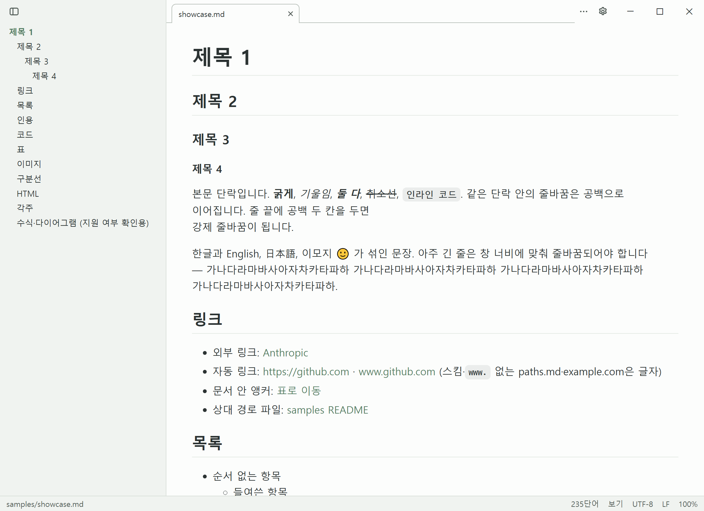

# Frond

Markdown(`.md`) 파일을 보고 편집하는 개인용 Windows 데스크톱 앱입니다. 설치기가 작고(약 5 MB) 빨리 뜹니다. 이름 Frond는 고사리 잎이라는 뜻입니다.

## 주요 기능

- `.md` 더블클릭 → 바로 렌더. 이미 떠 있으면 같은 창의 **새 탭**으로 엽니다
- **탭**과 **세션 복원** — 문서마다 편집 상태·스크롤·모드가 따로 남고, 다음 실행 때 지난 탭을 다시 엽니다
- **분할 뷰** — 왼쪽 소스, 오른쪽 미리보기. 스크롤이 서로 따라갑니다
- **폴더 트리**와 **최근 파일** — 왼쪽 탐색 영역에서 문서를 고릅니다
- GitHub 스타일 렌더: 표·체크리스트·각주·코드 구문 강조, **Mermaid**, **GitHub Alerts**, **수식**
- **소스 모드 편집과 저장** — 고친 줄만 다시 쓰고 인코딩·BOM·줄바꿈은 그대로 둡니다
- 다른 편집기와 부딪히지 않게: 외부 변경 알림, **비교**, 초안 백업
- **HTML 내보내기**와 **인쇄·PDF**
- **AI 앱 연동** — Claude Code·Codex가 만든 새 문서를 목록에 쌓습니다
- 라이트·다크 테마와 **사용자 테마 파일**

## 어디부터 볼까요

| 하고 싶은 일 | 페이지 |
|---|---|
| 설치하고 `.md`를 Frond로 열고 싶다 | [설치](getting-started/install.md) · [기본 앱으로 지정](getting-started/default-app.md) |
| 화면이 어떻게 생겼는지 알고 싶다 | [화면 둘러보기](getting-started/tour.md) |
| 문서를 읽고 찾고 싶다 | [파일 열기와 탭](read/open-and-tabs.md) · [목차와 찾기](read/toc-and-find.md) |
| 문서를 고치고 저장하고 싶다 | [편집과 저장](write/edit-and-save.md) |
| 색을 바꾸고 싶다 | [테마](customize/themes.md) |
| 단축키가 궁금하다 | [단축키](reference/shortcuts.md) |
