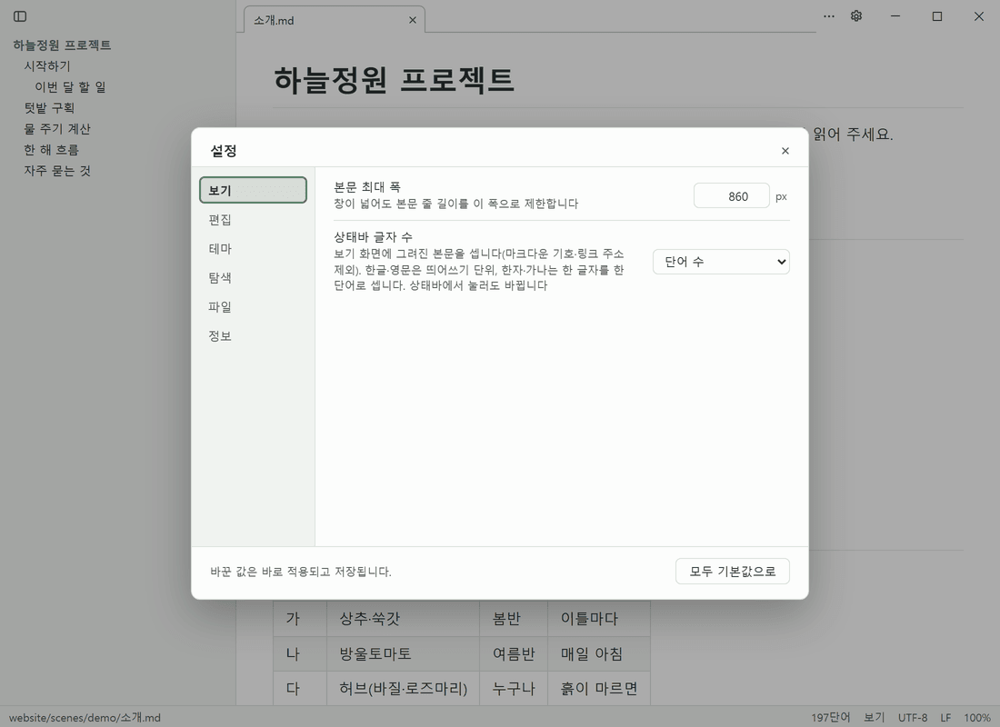

# 설정

`Ctrl+,` 또는 제목 표시줄의 톱니 버튼으로 엽니다. 왼쪽 탭을 고르면 그 분류의 항목만 보입니다. 바꾼 값은 바로 적용되고 저장됩니다. 기본값과 다른 항목 옆의 ↺ 버튼으로 하나씩, **모두 기본값으로**로 한꺼번에 되돌립니다.

| 탭 | 항목 | 기본값 | 범위 | 설명 |
|---|---|---|---|---|
| 보기 | 본문 최대 폭 | 860 px | 480–1920 px | 창이 넓어도 본문 줄 길이를 이 폭으로 제한 (소스 모드 줄바꿈 폭도 같음) |
| 보기 | 상태바 글자 수 | 단어 수 | 단어 / 글자 / 글자(공백 제외) / 표시 안 함 | 보기 화면에 그린 본문 기준. 상태바에서 눌러도 바뀝니다 |
| 편집 | 소스 글자 크기 | 15 px | 11–28 px | 소스 모드 편집기 글자 크기. 줌(`Ctrl+±`)은 따로 곱해집니다 |
| 편집 | 소스 줄바꿈 | 창 폭에 맞춰 줄바꿈 | 줄바꿈 / 없음 | 줄바꿈이면 본문처럼 가운데 한 단 |
| 편집 | 파일을 열 때 | 보기 모드로 | 보기 / 소스 | 문서를 처음 열 때의 모드 |
| 테마 | 테마 | 시스템 설정 따르기 | 시스템 / 내장·추천·구매자 전용·사용자 테마 | `Ctrl+Shift+D`로 바꿔도 여기에 저장됩니다 |
| 테마 | 라이트 테마 · 다크 테마 | 라이트 · 다크 | 해당 쪽 테마 | '시스템 설정 따르기'일 때 Windows 모드에 따라 쓸 테마 쌍. `Ctrl+Shift+D`는 이 둘 사이를 오갑니다 |
| 테마 | 테마 전환 시간 | 250 ms | 0–1000 ms | 색이 서서히 바뀌는 시간. 0이면 즉시, Windows 애니메이션 효과를 끄면 항상 즉시 |
| 탐색 | 제목 이동 시 위쪽 여백 | 24 px | 0–240 px | 목차·문서 안 링크로 제목에 이동할 때 제목 위에 남길 간격 |
| 탐색 | AI 훅이 만든 문서 | '새 문서' 목록에 쌓기 | 목록 / 뒤 탭 / 바로 열기 | Claude Code·Codex 훅이 새 md를 만들었을 때. 탐색기에서 연 파일은 늘 바로 엽니다 |
| 탐색 | 시작할 때 | 지난번 탭 다시 열기 | 다시 열기 / 빈 창 | 지난번 탭(모드·보던 위치)을 다시 엽니다 |
| 탐색 | 최근 파일 개수 | 20개 | 1–100개 | 탐색 영역에 보일 최근 파일 수 |
| 파일 | 초안 백업 간격 | 60초 | 0–300초 | 저장하지 않은 편집을 남기는 간격. 0이면 끔 |
| 정보 | (패널) | — | — | 버전·설치 방식·구매 상태. Microsoft Store판의 구매·구매 복원 자리(Store 출시 뒤에 열림) |

테마 탭 아래에는 테마 목록이 있습니다. 자세한 내용은 [테마](themes.md)를 봅니다.
