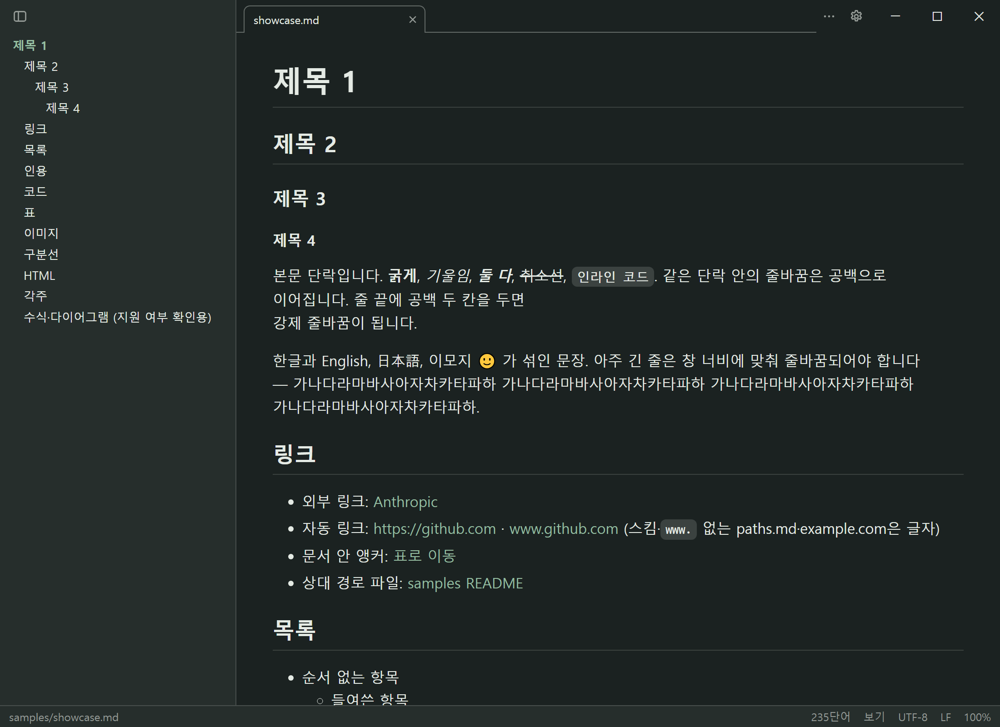
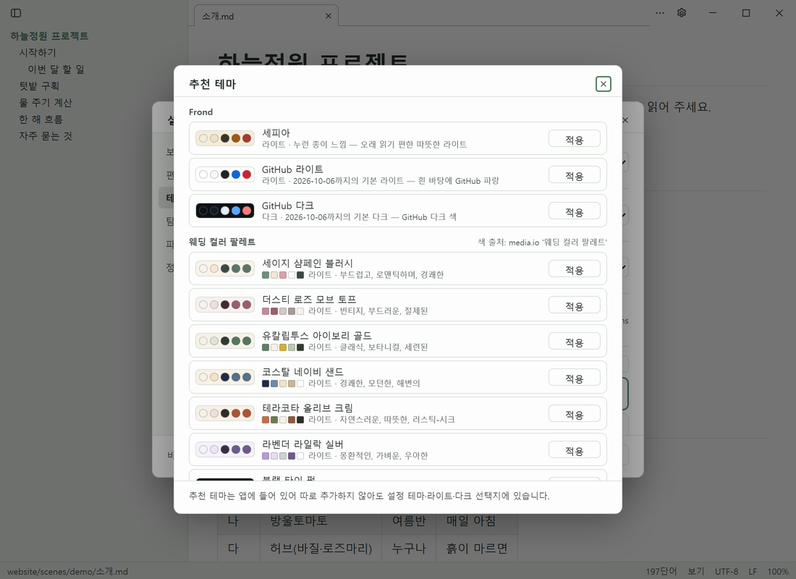

# 테마

기본은 Windows 설정(라이트/다크)을 따릅니다. `Ctrl+Shift+D`나 설정 **테마** 탭으로 바꿉니다. 내장 라이트·다크는 **미니멀 화이트 세이지 차콜** 팔레트입니다(흰 바탕·차콜 글자에 세이지 초록빛).

## 테마 목록

설정 **테마** 탭 아래의 **테마 목록**에서 테마를 고르고 관리합니다.

| 버튼 | 하는 일 |
|---|---|
| **추천 테마…** | 앱에 들어 있는 테마(세피아, GitHub 라이트·다크, 웨딩 컬러 팔레트 20종)를 팝업에서 둘러보고 **적용**합니다. 따로 추가하지 않아도 **테마**·**라이트 테마**·**다크 테마** 선택지에 있고, 쓰고 있는 추천 테마는 테마 목록에도 보입니다. 팔레트 테마는 원본 5색에서 배경·글자·강조를 정하고, 연한 강조색은 읽을 수 있도록 밝기를 낮춰 씁니다 |
| **가져오기…** | 테마 파일(`.json`)을 골라 테마 폴더(`문서\Frond\themes`)에 복사합니다. 파일이 잘못됐으면 어느 키·값이 틀렸는지 보여 주고 아무것도 저장하지 않습니다 |
| **적용 / 복제 / 내보내기 / 삭제** | 복제는 모든 색이 채워진 사본 파일을 만듭니다 — 새 테마를 만들 때 출발점으로 쓰세요. 내장 테마는 지울 수 없고, 쓰던 테마를 지우면 같은 쪽(라이트/다크) 내장 테마로 돌아갑니다 |
| **폴더 열기 / 다시 읽기** | 폴더에 직접 넣거나 고친 파일은 **다시 읽기**로 목록에 반영합니다 |

테마를 직접 만들려면 [테마 파일 만들기](theme-files.md)를 봅니다.

> [!NOTE]
> 테마 폴더는 문서 폴더 아래(`문서\Frond\themes`)입니다. 예전 위치(`%APPDATA%\Frond\themes`)에 있던 테마는 처음 실행할 때 옮겨집니다.
> 예전에 추천 테마를 **추가**해 폴더에 생긴 사본은 그대로 두며, 색이 같으면 목록에 한 번만 보입니다.

## 구매자 기능 (Microsoft Store판)

Microsoft Store판에서는 **사용자 테마 만들기(가져오기·복제)와 적용**, **구매자 전용 테마**(고사리 새벽·이끼 밤·한지·먹)가 한 번 구매로 열립니다. 보기·편집·저장 등 문서 기능과 내장·추천 테마는 모두 무료입니다. 설치기로 설치한 Frond는 처음부터 모두 열려 있습니다.

- 구매자 전용 테마는 **추천 테마…** 팝업 맨 아래에서 누구나 미리 볼 수 있습니다
- 구매 전에는 고른 사용자 테마가 같은 쪽(라이트/다크) 내장 테마로 대신 보이고, 설정값은 그대로 남아 구매하면 다시 보입니다
- 상태는 설정 **정보** 탭에서 봅니다. 구매는 Store 출시 뒤에 열립니다
