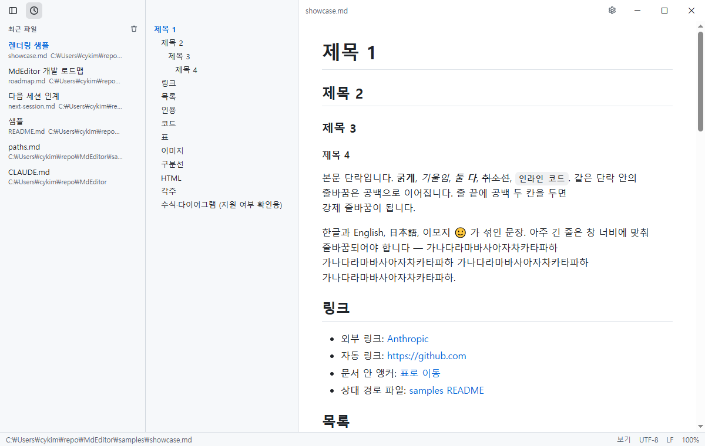

# 화면 둘러보기

| 영역 | 설명 |
|---|---|
| **제목 표시줄** (맨 위) | 가운데에 문서 탭이 보입니다. 빈 곳을 끌면 창 이동(화면 끝에 붙이기 가능), 두 번 클릭하면 최대화/복원. 창 가장자리를 끌어 크기를 바꿉니다. 왼쪽 끝은 탐색 영역 토글, 오른쪽은 문서 메뉴(⋯)·설정·최소화·최대화·닫기 |
| **탐색 영역** (왼쪽) | 위쪽 정사각형 탭으로 패널을 고릅니다 — **최근 파일**, **폴더**, **AI가 만든 새 문서**(안 읽은 수 배지). [탐색 영역](../read/navigation.md) 참고 |
| **목차** | 문서의 제목 목록. 클릭하면 그 제목으로 이동하고, 스크롤하면 지금 읽는 제목이 강조됩니다 |
| **본문** | 렌더된 문서(보기 모드), Markdown 원문 편집기(소스 모드), 또는 둘을 나란히(분할). 폭은 설정의 **본문 최대 폭**을 따릅니다 |
| **상태바** (맨 아래) | 아래 표 참고 |

## 상태바

| 항목 | 설명 |
|---|---|
| 파일 경로 | 지금 문서의 위치 |
| **새 문서 n** | AI 훅이 만든 안 읽은 문서. 누르면 목록이 열립니다 |
| 단어 수 | 눌러서 단어 ↔ 글자 ↔ 공백 제외 글자 |
| **보기/소스/분할** | 눌러서 모드 메뉴 |
| 인코딩 | 눌러서 다시 열기·변환. 해석 못 한 바이트가 있으면 빨간색 — [인코딩과 줄바꿈](../write/encoding-and-eol.md) |
| 줄바꿈 | 눌러서 LF·CRLF로 변환. 섞여 있으면 "(혼합)" |
| 줌 비율 | `Ctrl+=` / `Ctrl+-` / `Ctrl+0` |

관리자 권한으로 실행하면 빨간 **관리자 권한 실행 중**이 보입니다.
