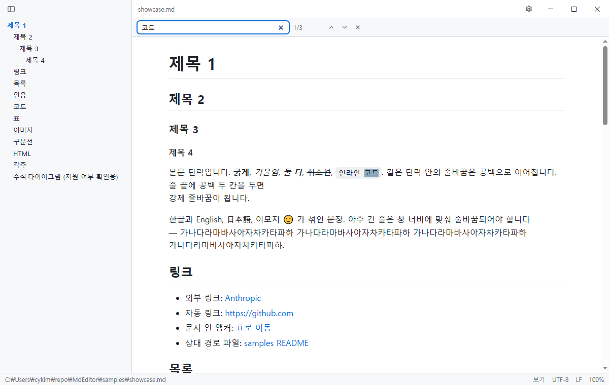

# 목차와 찾기

## 목차

- 제목을 누르면 그 제목으로 이동합니다(소스 모드에서는 그 줄로). 제목 위에 남는 간격은 설정 **제목 이동 시 위쪽 여백**으로 바꿉니다
- 목차 오른쪽 경계를 끌어 폭을 바꿉니다(최소 160 px, 최대는 남은 폭의 절반). 경계를 두 번 누르면 기본 폭(260 px), 경계에 포커스를 두고 `←`/`→`로도 조절됩니다
- 아주 좁게(80 px 아래로) 끌면 목차가 접힙니다. `Ctrl+\`로 다시 엽니다
- 제목이 없는 문서, 창 폭이 720 px 이하일 때는 목차가 숨겨집니다
- 소스 모드에서 편집하면 작은 문서는 목차가 편집을 따라 바로 갱신됩니다

## 찾기

- **보기 모드** `Ctrl+F`: 위쪽 찾기 막대. `Enter` 다음, `Shift+Enter` 이전, `Esc` 닫기. 대소문자는 가리지 않고, `**굵게**`처럼 서식 경계에 걸친 글자도 찾습니다
- **소스·분할 모드** `Ctrl+F`: 편집기 찾기 패널(대소문자 구분·단어 단위·정규식)

## 바꾸기

소스·분할 모드 `Ctrl+H`: 찾기·바꾸기 패널에서 모두 바꾸기까지 합니다. 보기 모드에서 `Ctrl+H`를 누르면 소스 모드로 넘어가 패널을 엽니다.
