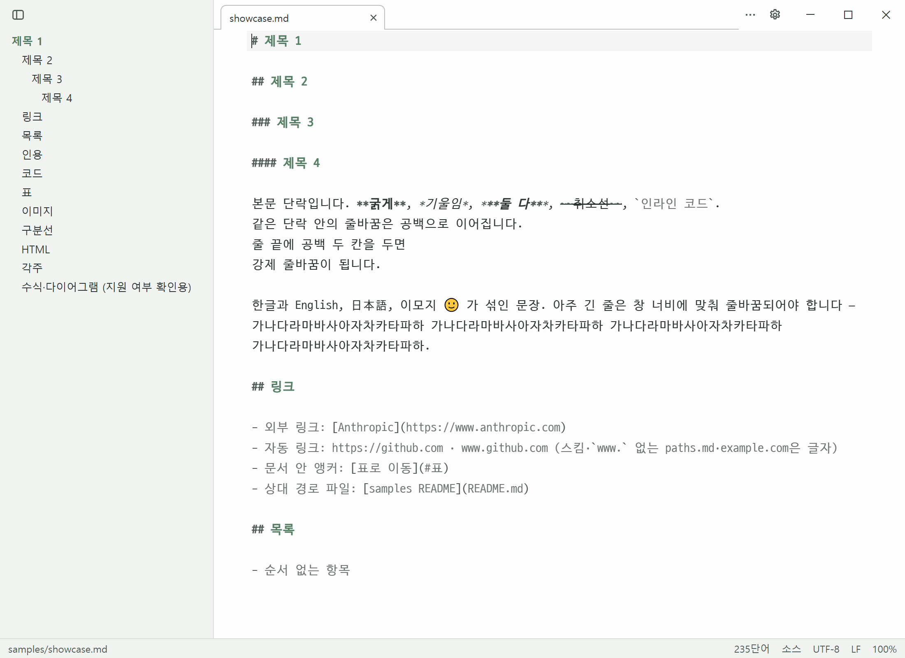

# 편집과 저장

## 모드

- `Ctrl+/`로 **보기 ↔ 소스** 모드를 오갑니다. 보던 위치가 그대로 이어지고, 소스 모드로 들어가면 커서가 보던 줄에 놓입니다. 설정 **파일을 열 때**로 처음 모드를 고릅니다
- `Ctrl+Shift+/`(또는 상태바 모드 메뉴)로 **분할 뷰**를 켭니다. 왼쪽 소스, 오른쪽 미리보기이고, 어느 쪽을 스크롤해도 다른 쪽이 같은 자리로 따라옵니다. 편집하면 0.1초쯤 뒤에 바뀐 블록만 다시 그려 이미지가 깜빡이지 않습니다. 가운데 경계를 끌어 폭을 바꾸고(두 번 누르면 반반), 2 MB가 넘는 문서는 저장할 때 미리보기를 갱신합니다

## 저장

- `Ctrl+S` 저장, `Ctrl+Shift+S` 다른 이름으로 저장(원래 파일의 인코딩·줄바꿈을 그대로 가져갑니다). 한글 조합 중에 눌러도 조합을 확정한 뒤 저장합니다
- **바이트 보존**: 고친 줄만 다시 쓰고, 나머지 줄의 줄바꿈(LF/CRLF/혼합)·인코딩·BOM·끝 개행은 원본 그대로입니다. 고친 것이 없으면 원본 바이트를 그대로 씁니다

## 저장 충돌

연 뒤에 다른 프로그램이 파일을 저장했으면 덮어쓰기 전에 **다른 이름으로 저장 / 덮어쓰기 / 취소**를 묻습니다. 파일이 지워졌으면 **다시 만들기**를 고릅니다. 같은 팝업에서 **비교**도 고를 수 있습니다([외부 변경](external-changes.md)).

## 읽기 전용 문서

해석 못 한 바이트가 있는 파일(손실 디코드)은 원본이 망가지지 않게 읽기 전용입니다. 상태바 인코딩을 눌러 맞는 인코딩으로 다시 여세요([인코딩과 줄바꿈](encoding-and-eol.md)).

## 닫기

저장하지 않은 변경이 있으면 창을 닫기 전에 묻습니다(제목 표시줄 닫기·`Alt+F4` 모두).
