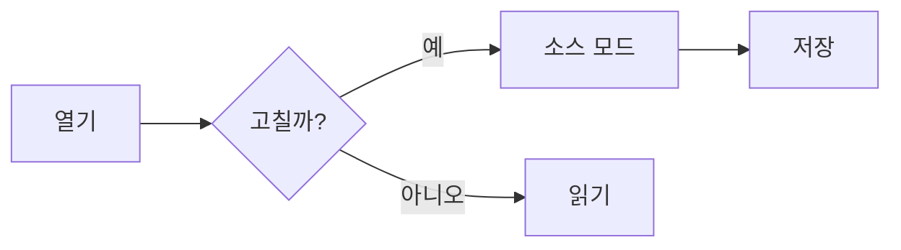
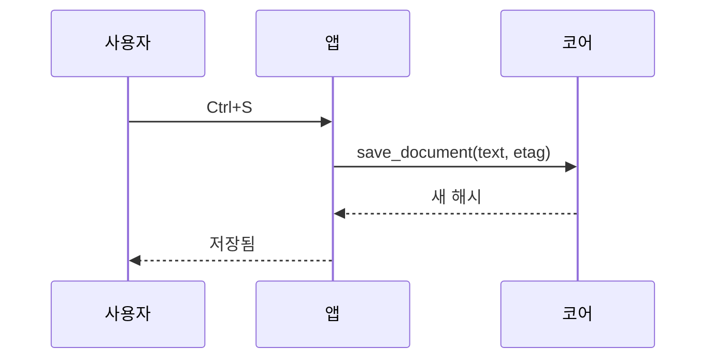
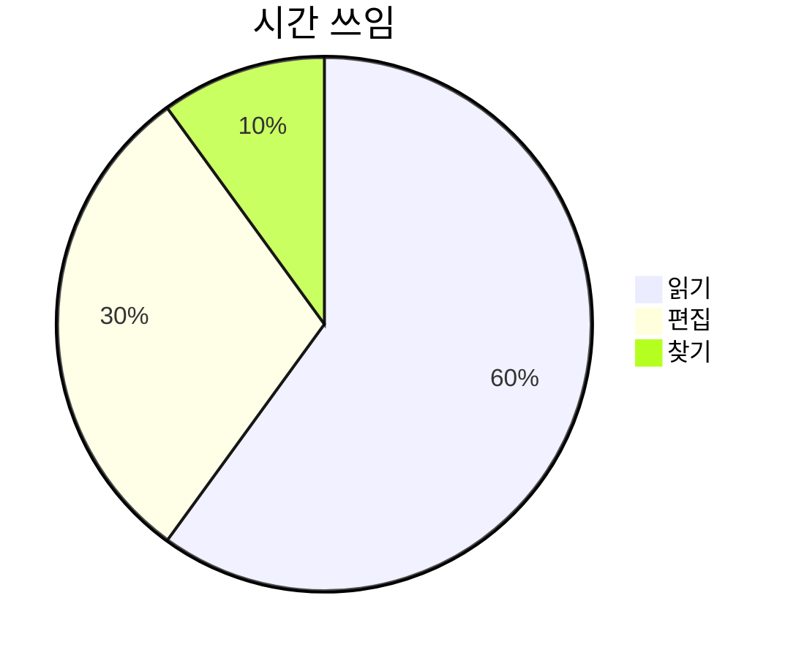

# 확장 렌더 샘플

V2(로드맵 Phase 4)에서 더한 렌더를 눈으로 확인하는 샘플이다. 기본 문법은 [showcase.md](showcase.md).

## GitHub Alerts

> [!NOTE]
> 알아 두면 좋은 정보. **굵게**와 `코드`도 된다.

> [!TIP]
> 더 잘 쓰는 방법.

> [!IMPORTANT]
> 꼭 알아야 하는 것.
>
> 두 번째 문단.

> [!WARNING]
> 바로 주의해야 하는 것.

> [!CAUTION]
> 하면 위험한 것.

> [!note]
> 소문자 표시도 된다 (GitHub과 같음).

> [!NOTE] 같은 줄에 글이 있으면 보통 인용이다.

> [!NOTE]

위 인용은 표시뿐이라 보통 인용이다.

- 목록 안의 인용은 alert가 아니다
  > [!TIP]
  > 보통 인용으로 보인다.

## Mermaid







문법이 틀린 그림은 코드 블록 아래에 이유를 보인다:

```mermaid
graph LR
  A -->
```

## 수식 (KaTeX)

인라인 $E = mc^2$, 분수 $\frac{a}{b}$, 백틱 표기 $`\sqrt{x^2+y^2}`$. 돈 표기 $5와 $10은 글자 그대로다.

$$
\sum_{i=1}^{n} i = \frac{n(n+1)}{2}
$$

```math
\begin{aligned}
f(x) &= (x+1)^2 \\
     &= x^2 + 2x + 1
\end{aligned}
```

틀린 수식은 빨간 원문으로 남는다: $\frac{1}{$
