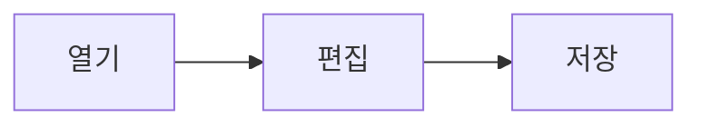

# 제목 1

## 제목 2

### 제목 3

#### 제목 4

본문 단락입니다. **굵게**, *기울임*, ***둘 다***, ~~취소선~~, `인라인 코드`.
같은 단락 안의 줄바꿈은 공백으로 이어집니다.
줄 끝에 공백 두 칸을 두면  
강제 줄바꿈이 됩니다.

한글과 English, 日本語, 이모지 🙂 가 섞인 문장. 아주 긴 줄은 창 너비에 맞춰 줄바꿈되어야 합니다 — 가나다라마바사아자차카타파하 가나다라마바사아자차카타파하 가나다라마바사아자차카타파하 가나다라마바사아자차카타파하.

## 링크

- 외부 링크: [Anthropic](https://www.anthropic.com)
- 자동 링크: https://github.com · www.github.com (스킴·`www.` 없는 paths.md·example.com은 글자)
- 문서 안 앵커: [표로 이동](#표)
- 상대 경로 파일: [samples README](README.md)

## 목록

- 순서 없는 항목
  - 들여쓴 항목
    - 더 들여쓴 항목
- 두 번째 항목

1. 순서 있는 항목
2. 두 번째
   1. 하위 번호
3. 세 번째

- [x] 완료된 할 일
- [ ] 남은 할 일

## 인용

> 인용문입니다.
>
> > 중첩 인용문입니다.

## 코드

```csharp
public static string Greet(string name) => $"Hello, {name}!";
```

```typescript
const greet = (name: string): string => `Hello, ${name}!`;
```

```
언어 지정 없는 코드 블록
    들여쓰기가 유지되어야 합니다
```

## 표

| 왼쪽 정렬 | 가운데 정렬 | 오른쪽 정렬 |
|:---|:---:|---:|
| 사과 | 🍎 | 1,200 |
| 바나나 | 🍌 | 800 |
| 아주 긴 셀 내용이 들어가면 열 너비가 어떻게 되는지 | ? | 0 |

## 이미지

상대 경로 이미지 (파일 없음 — 깨진 이미지 표시 확인용):


## 구분선

---

## HTML

<details>
<summary>펼치기</summary>

접혀 있던 내용입니다.

</details>

허용 목록 태그: <kbd>Ctrl</kbd>+<kbd>S</kbd>, H<sub>2</sub>O, x<sup>2</sup>, <mark>형광펜</mark>, <ins>추가</ins>·<del>삭제</del>, <abbr title="HyperText Markup Language">HTML</abbr>,<br>여기서 줄바꿈.

<p align="center">
  
</p>

목록 밖 태그는 글자 그대로: List<String>, <section>, <script>alert(1)</script>, <iframe src="x"></iframe>.
속성도 목록만 남는다: <span style="color:red" onclick="alert(1)" title="툴팁">style·onclick이 빠진 span</span>

<!-- 주석은 보이지 않습니다 -->

## 각주

각주가 붙은 문장입니다.[^1]

[^1]: 각주 내용입니다.

## 수식·다이어그램 (지원 여부 확인용)

인라인 수식 $E = mc^2$ 와 블록 수식:

$$
\sum_{i=1}^{n} i = \frac{n(n+1)}{2}
$$


